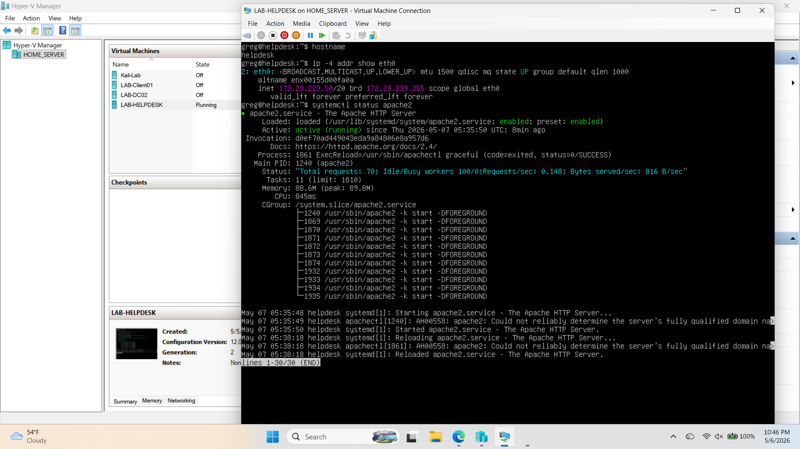
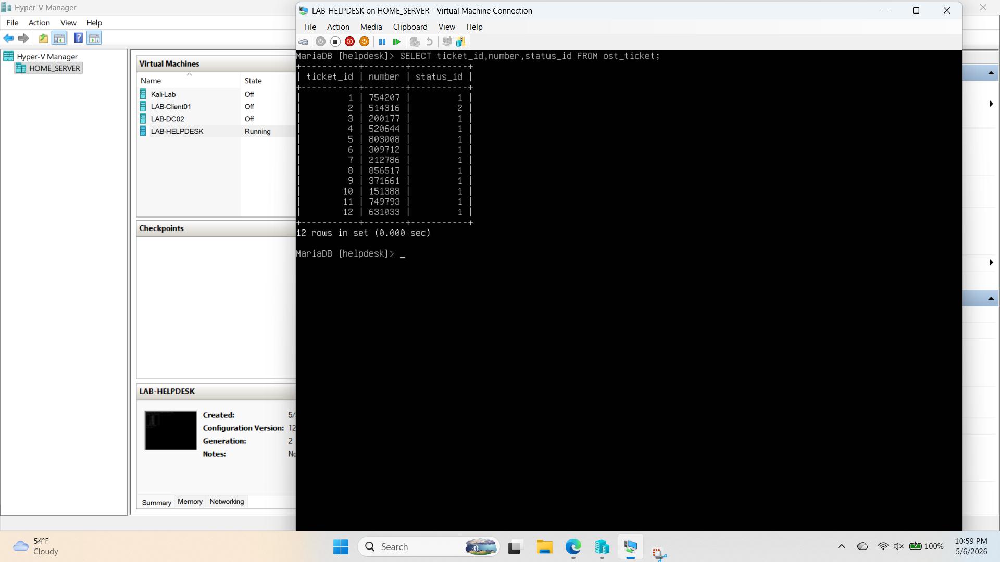
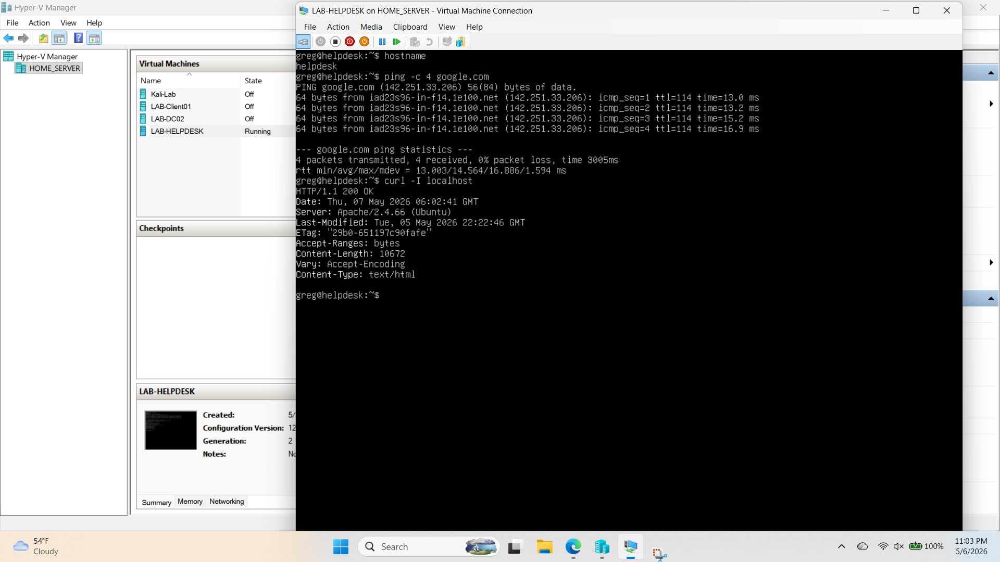
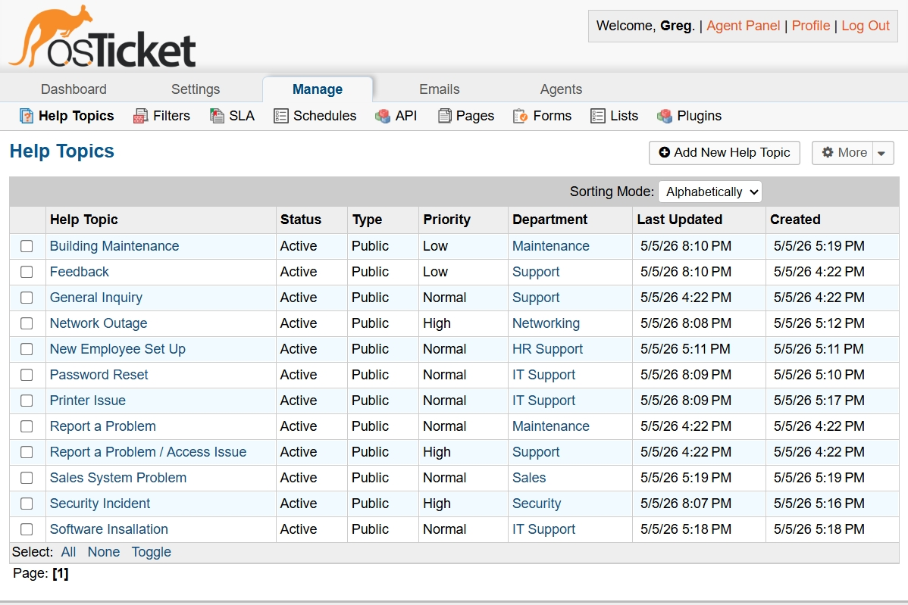
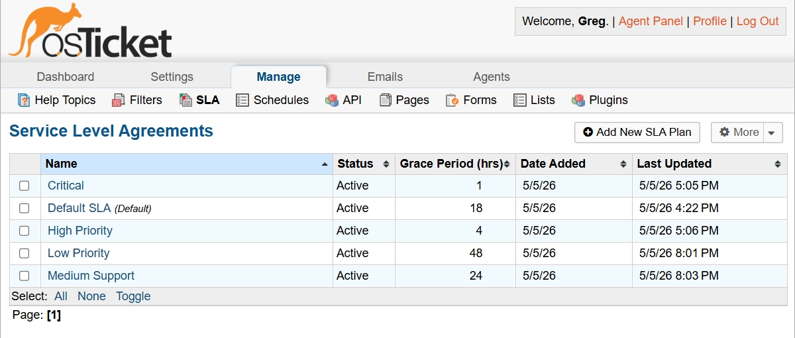
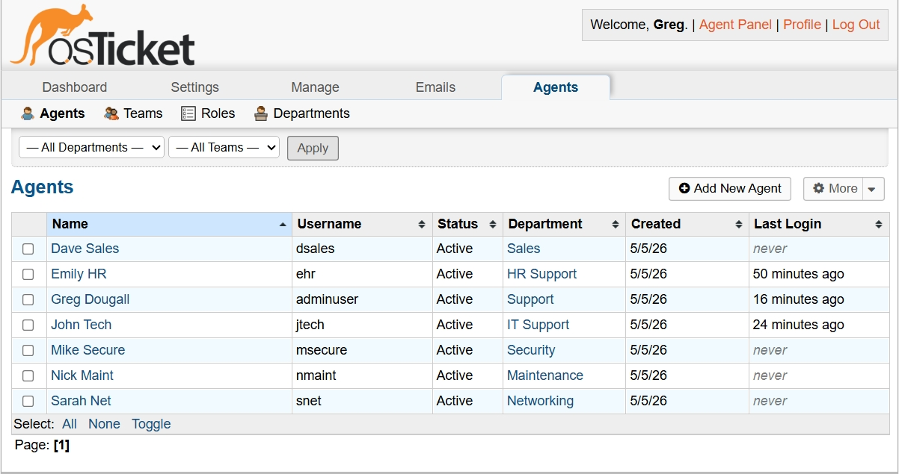
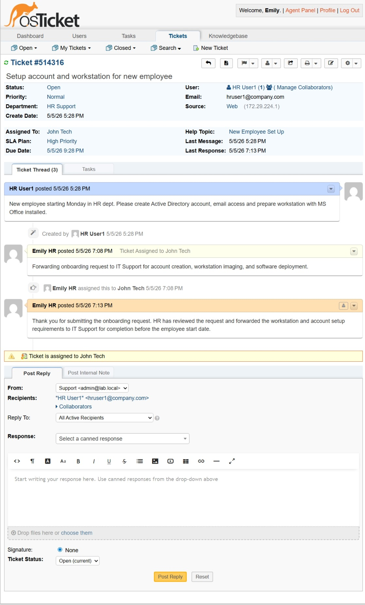
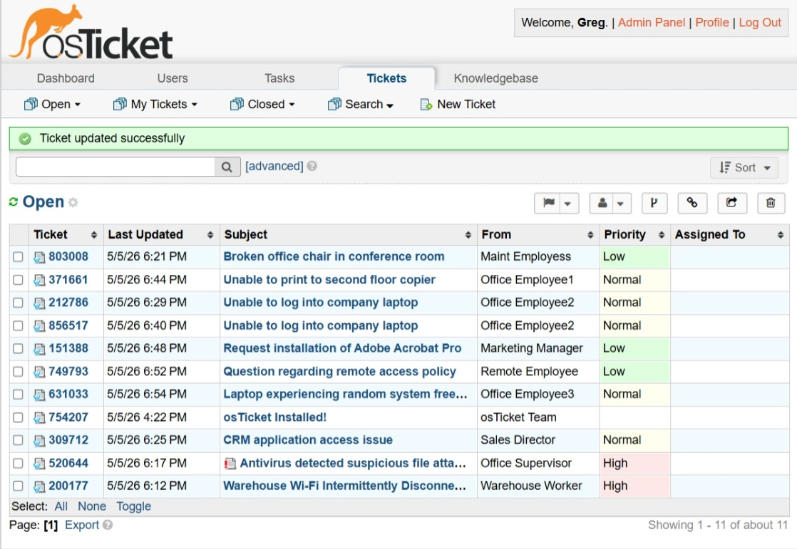
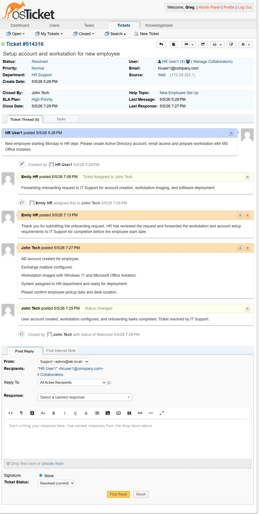

# osTicket Helpdesk Lab

Built and configured a fully functional osTicket help desk lab environment using Ubuntu Server, Apache, MariaDB, PHP, and Hyper-V virtualization. This project demonstrates ticket workflows, SLA management, departmental routing, agent permissions, and end-to-end IT support operations.

---

## Overview

This lab simulates a real-world IT help desk environment with multiple departments, agents, ticket queues, and support workflows. Users submit tickets through the osTicket portal, tickets are routed to the appropriate department, assigned to agents, updated with internal notes and replies, and resolved through a complete ticket lifecycle process.

---

## Project Goals

The goal of this lab was to simulate a realistic IT support environment while gaining hands-on experience with Linux server administration, web application deployment, database management, ticket workflows, and support operations documentation.

This project was designed to demonstrate practical skills commonly used in help desk, junior system administration, and IT support roles.

---

## Lab Environment

| Component | Details |
|---|---|
| Host System | Windows 11 |
| Virtualization | Hyper-V |
| Server OS | Ubuntu Server |
| Web Server | Apache2 |
| Database | MariaDB |
| Application | osTicket |
| Backend/Scripting | PHP |

---

## Technologies Used

- Ubuntu Server
- Apache2
- MariaDB
- PHP
- osTicket
- Windows 11
- Hyper-V

---

## Features Configured

- Multi-department help desk environment
- Agent accounts and role-based permissions
- SLA plan configuration
- Help topics and ticket routing
- Ticket assignment workflows
- Internal notes and ticket replies
- Ticket lifecycle management
- End-user support portal
- Department-based ticket visibility

---

## Example Ticket Scenarios

- New Employee Onboarding
- Password Reset Requests
- Printer Troubleshooting
- Network Outage Escalation
- Security Incident Reporting
- Software Installation Requests

---

## Ticket Workflow Demonstrated

1. User submits a support request
2. Ticket is routed to the appropriate department
3. Department assigns the ticket to a technician
4. Internal notes and ticket updates are added
5. Technician responds to the user
6. Issue is resolved
7. Ticket status is updated and closed

---

# Lab Environment Screenshots

---

## Hyper-V Virtual Lab Environment

Hyper-V virtual environment hosting the Ubuntu-based osTicket server and supporting lab infrastructure.

---

## MariaDB osTicket Database Verification

MariaDB command-line verification showing osTicket database tables successfully installed and configured.

---

## Apache Web Service Connectivity Test

Linux terminal connectivity testing verifying Apache web services and osTicket web portal accessibility.

---

## Help Topics and SLA Routing

Configured help topics and SLA routing policies to organize incoming support requests by department, category, and urgency.

---

## SLA Priority Management

Created SLA plans to define response expectations for normal, high-priority, and urgent support scenarios.

---

## Agents and Departments

Created multiple departments and agent accounts with role-based permissions to simulate a real-world multi-team IT support environment.

---

## HR Onboarding Ticket Workflow

Demonstrated department-based ticket routing by forwarding a new employee onboarding request from HR Support to IT Support.

---

## Multi-Ticket Queue Management

Created multiple realistic support tickets to demonstrate queue management, ticket prioritization, and operational workload visibility.

---

## End-to-End Ticket Resolution

Demonstrated the full ticket lifecycle, including ticket creation, department assignment, technician response, internal documentation, and final resolution.

---

## Linux and Server Administration Tasks

- Installed and configured Ubuntu Server
- Configured Apache web server
- Installed and secured MariaDB
- Configured PHP dependencies for osTicket
- Managed Linux file permissions and ownership
- Edited configuration files through the Linux terminal
- Verified database connectivity through MariaDB CLI
- Removed default installation setup files for security
- Restarted and verified Apache and MariaDB services
- Performed troubleshooting through terminal commands and log analysis

---

## Skills Demonstrated

- Help desk administration
- Ticket queue management
- SLA configuration
- User and agent account management
- Department-based access control
- IT support workflow documentation
- Linux server administration
- Apache, MariaDB, and PHP configuration
- Virtual machine deployment using Hyper-V
- Technical troubleshooting
- Customer support process design
- End-to-end ticket lifecycle management

---

## Future Improvements

- Configure email integration
- Add LDAP or Active Directory authentication
- Expand the knowledge base
- Add automated ticket escalation
- Create reporting and analytics dashboards
- Document full installation and configuration procedures
